# Lab 2 — Campus Switching: VLANs, Rapid PVST+ Load Balancing & EtherChannel

| | |
|---|---|
| **Type** | Layer 2 Campus Switching — Multi-VLAN, Redundant Distribution |
| **Platform** | Cisco Packet Tracer |
| **IOS Version** | Cisco IOS (Catalyst 2960 Series Switches) |
| **Skills Demonstrated** | VLAN segmentation, trunk pruning, native VLAN hardening, LACP EtherChannel, Rapid PVST+ per-VLAN load balancing, STP port roles, PortFast, BPDU Guard, Root Guard, distribution layer failover |
| **Devices** | 2× Distribution Switches (DSW1, DSW2), 2× Access Switches (ASW1, ASW2), 4× PCs |
| **Time to Review** | ~4 min |

---

## Topology

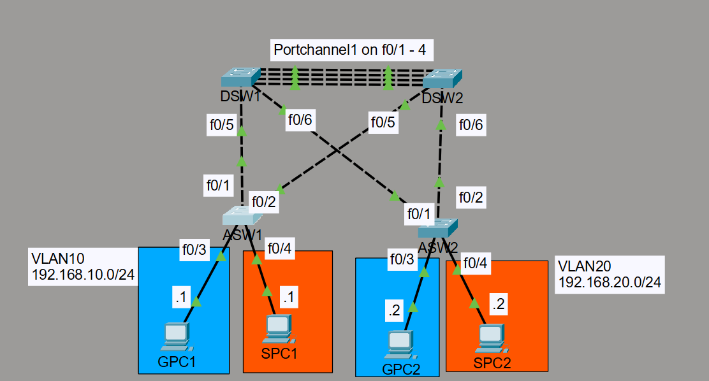

*Post-failure topology with DSW1 offline:*

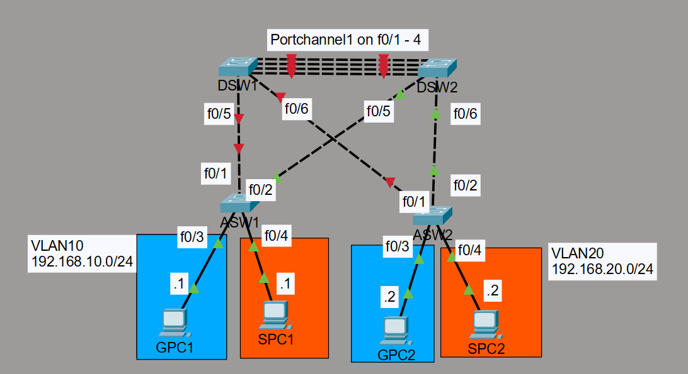

---

## What Was Built & Why

This lab simulates the switching layer of a university campus network — a two-tier architecture consisting of a distribution layer and an access layer, designed around three core principles: **traffic segmentation**, **redundancy**, and **autonomous failover**.

Two distribution switches (DSW1 and DSW2) sit at the top of the hierarchy, interconnected by a **4-link LACP EtherChannel** ([verified here](#etherchannel-verification)) that presents as a single logical high-bandwidth trunk. Below them, two access switches (ASW1 and ASW2) each serve two categories of users — Guest devices on **VLAN 10** and Staff devices on **VLAN 20** — connected via redundant uplinks to both distribution switches. This redundancy is intentional: every access switch has two paths to the distribution layer, one through DSW1 and one through DSW2. Without a loop-prevention mechanism, this would cause a broadcast storm and bring the network down instantly. That mechanism is **Rapid PVST+**.

Rather than simply enabling STP and accepting its defaults, the distribution layer was configured for **per-VLAN load balancing** — DSW1 was elected primary root bridge for VLAN 10 and secondary for VLAN 20, with DSW2 configured as the inverse ([DSW1 STP](#stp-verification---dsw1) | [DSW2 STP](#stp-verification---dsw2)). This ensures that VLAN 10 traffic flows preferentially through DSW1 while VLAN 20 traffic flows through DSW2, keeping both distribution switches actively forwarding rather than one sitting idle. The result is a topology where bandwidth utilisation is distributed across the infrastructure by design, not by accident.

All inter-switch links were configured as **802.1Q trunks**, explicitly pruned to carry only VLAN 10 and 20 ([verified here](#trunk-verification)), eliminating unnecessary broadcast flooding from VLANs that have no business crossing those links. The native VLAN was changed from the default VLAN 1 to **VLAN 99** on all trunks — a deliberate security decision that closes the VLAN hopping attack vector inherent in Cisco's default trunk configuration. All unused switch ports were administratively shut down and assigned to **VLAN 999** (Dead), ensuring no unauthorised device can gain network access by plugging into an idle port ([VLAN summary](#vlan-verification)).

On the access layer, every port facing an end host was configured with **PortFast** and **BPDU Guard** ([verified here](#portfast--bpdu-guard-verification)). PortFast bypasses the standard STP listening and learning states — which take up to 30 seconds — allowing end devices to reach the network immediately upon connection. BPDU Guard complements this by immediately error-disabling the port if a BPDU is received, preventing a rogue switch from being plugged into an access port and potentially manipulating the STP topology. On the distribution layer, **Root Guard** was applied on all ports facing the access switches, ensuring that no access switch can ever win a root bridge election — a critical hardening measure that protects the integrity of the carefully designed per-VLAN STP topology.

---

## An Honest Design Observation — STP Suboptimal Forwarding

During verification, an interesting STP behaviour was identified worth documenting explicitly. Examining ASW1's STP output for VLAN 20 ([ASW1 VLAN 20 STP](#stp-verification---asw1)) reveals that Fa0/1 (uplink to DSW1) is the **Alternate/Blocking** port, while Fa0/2 (uplink to DSW2) is the **Root Port**. This is correct and expected — DSW2 is the root for VLAN 20, so ASW1's root port correctly faces DSW2.

However, examining DSW2's VLAN 20 output ([DSW2 VLAN 20 STP](#stp-verification---dsw2)) shows that Fa0/5 (facing ASW1) was previously showing as **Alternate/Blocking**, meaning DSW1 was winning the Designated port election on that segment. This created a scenario where VLAN 20 traffic from ASW1 took the path `ASW1 → DSW1 → EtherChannel → DSW2` rather than the direct `ASW1 → DSW2` — a classic case of **STP suboptimal forwarding**.

This happens because STP elects Designated ports based on Bridge ID, not physical proximity. DSW1's superior Bridge ID on that segment caused it to win the Designated port role even though DSW2 is the root. The remediation would be to manually adjust the STP port cost on ASW1's uplink to DSW2 for VLAN 20, making DSW2's path more attractive. This was intentionally left uncorrected in this lab — not because it was missed, but because it demonstrates a real-world STP behaviour that network engineers encounter and must be able to diagnose. Blind optimisation without understanding why is more dangerous than a documented suboptimal path.

Notably, this behaviour also demonstrates the EtherChannel carrying live inter-distribution traffic — VLAN 20 frames from ASW1 cross the Po1 bundle on their way to DSW2, which is precisely the use case the EtherChannel was designed for in a topology where a Layer 3 device sits upstream.

---

## Verification

### VLAN Verification

`show vlan brief` on DSW1 confirms all VLANs are correctly named and populated. VLAN 1 carries no user ports. All unused ports are assigned to VLAN 999 (Dead) and administratively shut down. VLAN 10 (Guests) and VLAN 20 (Staff) show no access ports at the distribution layer — correct, as all inter-switch links are trunks and appear only in `show interfaces trunk`.

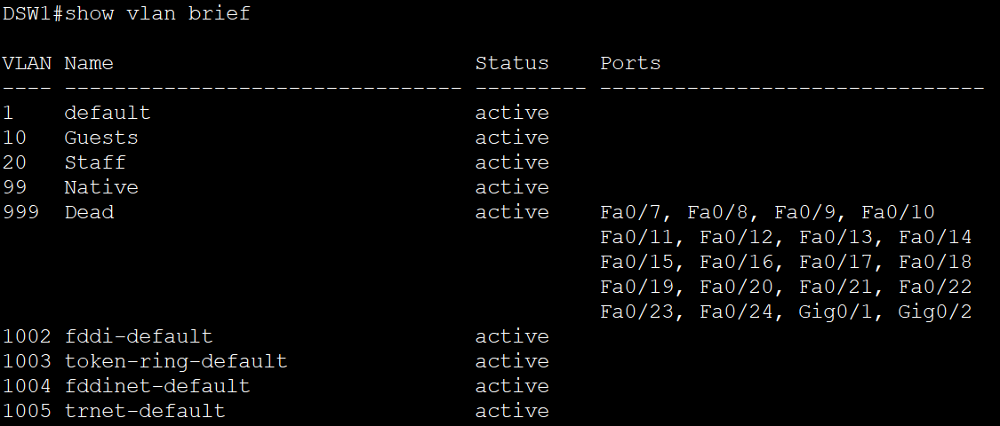

### Trunk Verification

`show interfaces trunk` on DSW1 confirms all three trunk interfaces (Po1, Fa0/5, Fa0/6) are trunking with native VLAN 99 and carrying only VLANs 10 and 20 — no unnecessary VLANs bleeding across the infrastructure.

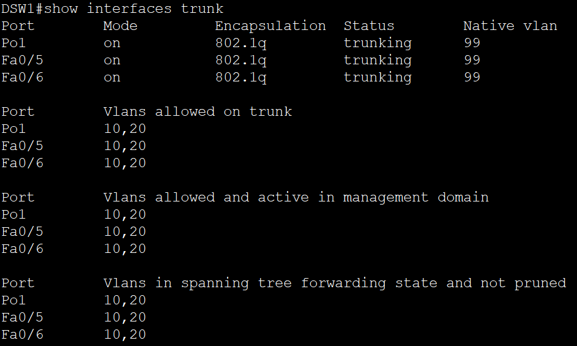

### EtherChannel Verification

`show etherchannel summary` on DSW1 confirms Po1 is in **SU** state (Layer 2, in use) with all four member ports (Fa0/1–Fa0/4) in **P** state (bundled). LACP negotiated the bundle successfully — all four physical links are active and load-sharing as a single logical interface.

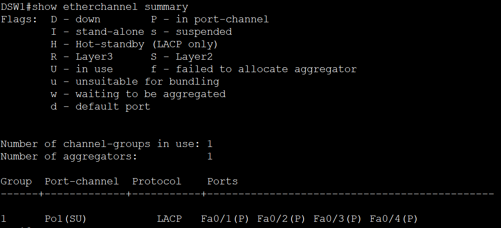

### PortFast & BPDU Guard Verification

`show running-config | begin interface FastEthernet0/3` on ASW1 confirms both access-facing ports are correctly configured — access mode, correct VLAN assignment, PortFast enabled, and BPDU Guard enabled. This configuration is mirrored identically on ASW2.

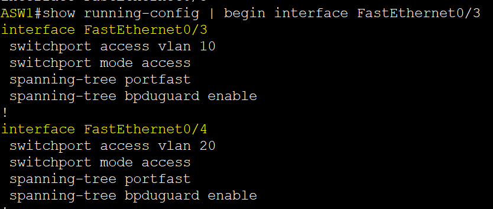

---

## STP Verification — Baseline (Before Failure)

### STP Verification — DSW1

DSW1 confirms **"This bridge is the root"** for VLAN 10 with priority 24586, and correctly shows Po1 as Root Port for VLAN 20 — reaching DSW2 (the VLAN 20 root) via the EtherChannel. All DSW1 ports are Designated/Forwarding for VLAN 10, confirming it is the authoritative root for that VLAN.

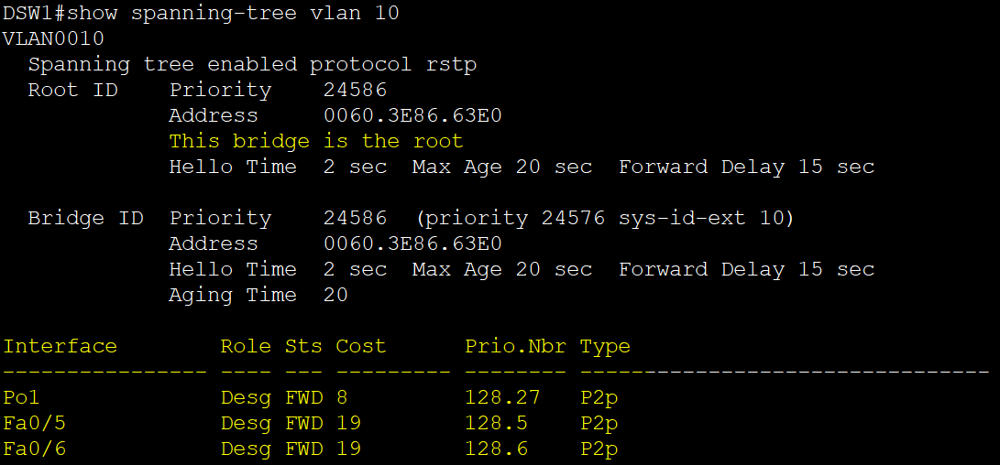
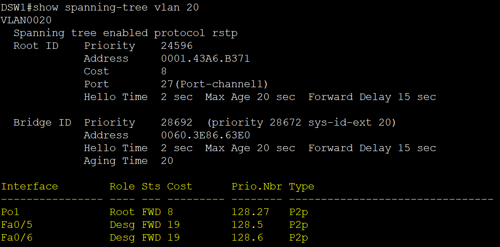

### STP Verification — DSW2

DSW2 confirms **"This bridge is the root"** for VLAN 20 with priority 24596. For VLAN 10, DSW2's Root Port is Po1 — correctly reaching DSW1 (the VLAN 10 root) via the EtherChannel. Load balancing is confirmed: each distribution switch is the authoritative root for one VLAN, both actively forwarding.

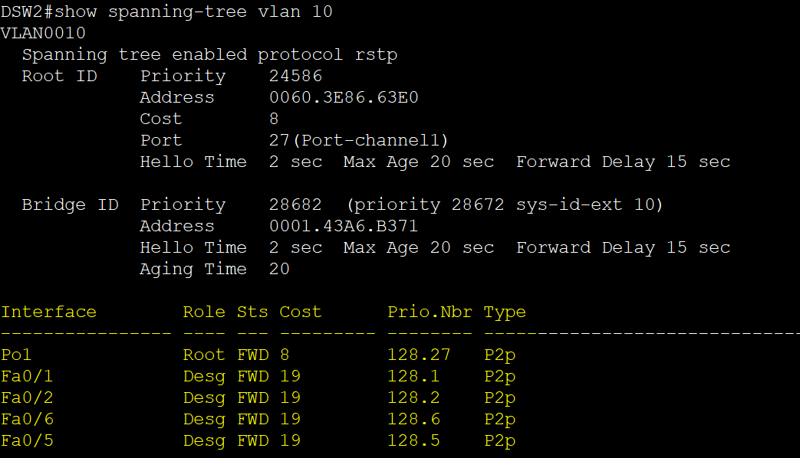
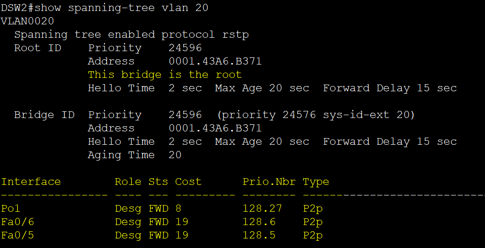

### STP Verification — ASW1

ASW1 shows correct per-VLAN root port selection — Fa0/1 (facing DSW1) is Root for VLAN 10, Fa0/2 (facing DSW2) is Root for VLAN 20. The opposing uplink is Alternate/Blocking in each case, demonstrating STP's loop prevention actively working alongside the per-VLAN load balancing design.

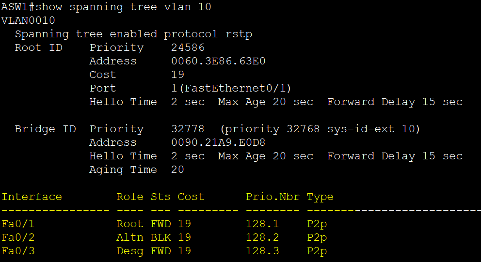
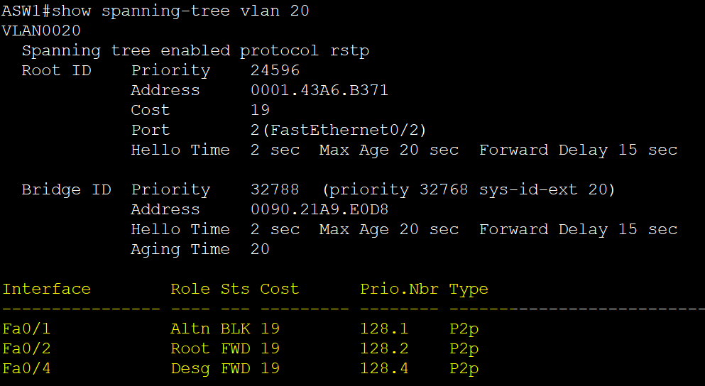

### STP Verification — ASW2

ASW2 mirrors ASW1's behaviour — Fa0/1 (facing DSW1) is Root for VLAN 10, Fa0/2 (facing DSW2) is Root for VLAN 20 — confirming consistent per-VLAN path selection across the entire access layer.

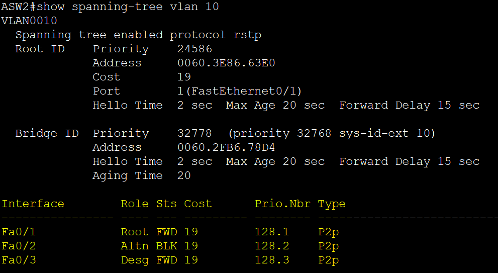
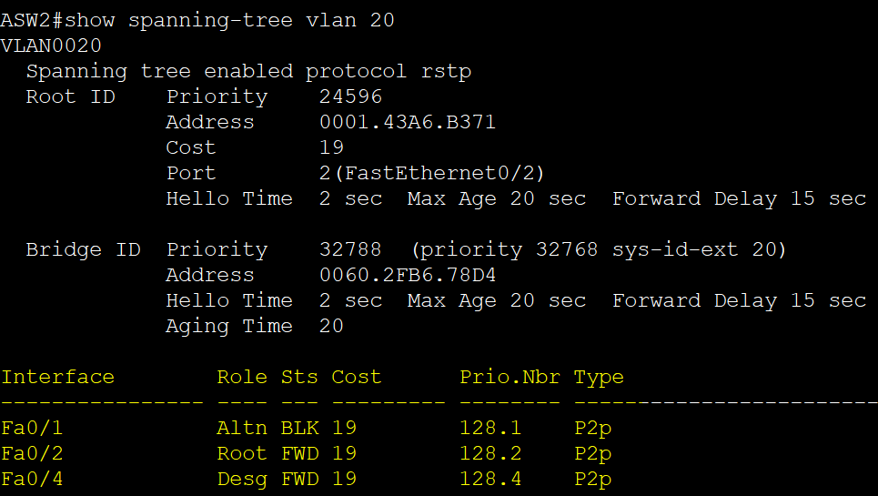

---

## Baseline Connectivity — Before Failure

Three pings were issued to establish the baseline:

**Guest PC cross-switch (VLAN 10):** GPC1 (192.168.10.1) → GPC2 (192.168.10.2) — 4/4 packets received, 0% loss. Cross-switch same-VLAN reachability confirmed.

**Staff PC cross-switch (VLAN 20):** SPC1 (192.168.20.1) → SPC2 (192.168.20.2) — 4/4 packets received, 0% loss. Cross-switch same-VLAN reachability confirmed.

**Cross-VLAN isolation test:** GPC1 (192.168.10.1) → SPC1 (192.168.20.1) — 0/4 packets received, 100% loss. VLAN isolation functioning correctly — Guest devices cannot reach Staff devices at Layer 2. This is not a misconfiguration; it is the security model working as designed. In a production environment, controlled inter-VLAN communication would be introduced via a Layer 3 device upstream, which is addressed in Lab 4.

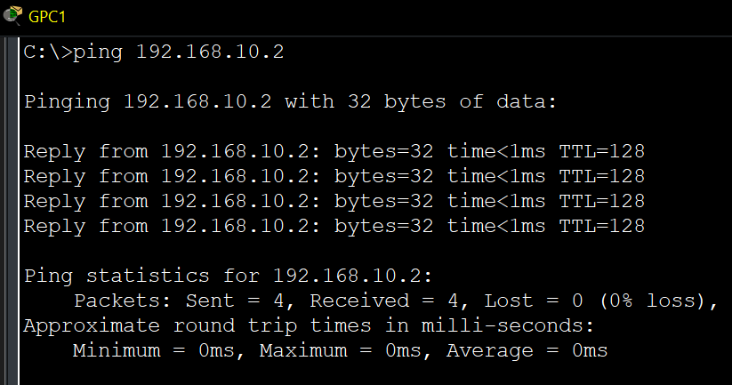
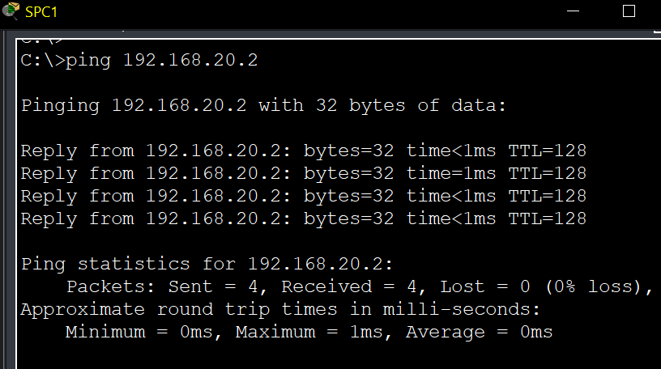
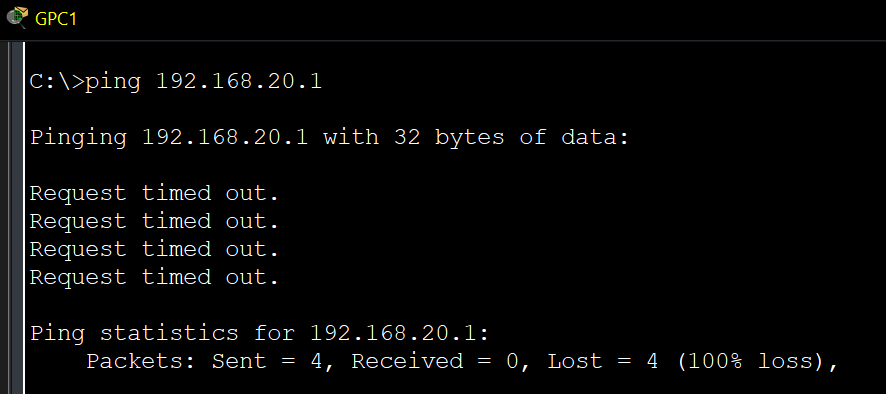

---

## Distribution Layer Failure — DSW1 Shutdown

All DSW1 uplinks (Fa0/1–Fa0/6, including all EtherChannel member ports and access-layer links) were administratively shut down to simulate a complete distribution switch failure. The IOS console logged individual interface state changes and the Port-channel1 going down in real time — confirming the event was detected immediately by the switching infrastructure.

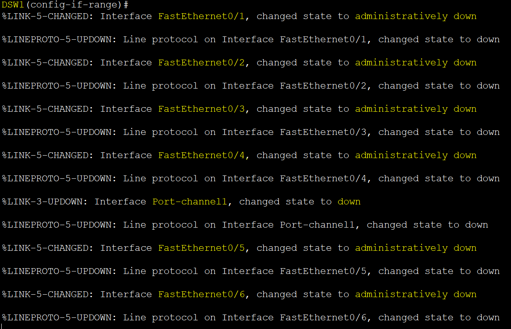

---

## STP Re-election — Post Failure

### DSW2 Post-Failure

With DSW1 offline, DSW2 autonomously won the root bridge election for **both VLAN 10 and VLAN 20**. No manual intervention was required. The `show spanning-tree vlan 10` output now shows **"This bridge is the root"** on DSW2 — a role it did not hold before the failure. Previously blocking ports on the access switches unblocked and transitioned to forwarding, restoring full Layer 2 connectivity through DSW2.

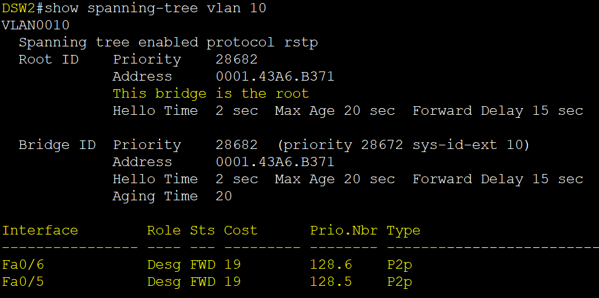
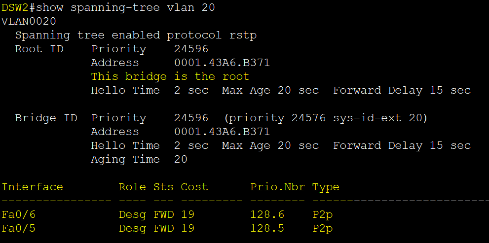

---

## Post-Failure Connectivity — Network Self-Healed

All three pings were repeated immediately after DSW1's failure:

- **VLAN 10 (Guest):** GPC1 → GPC2 — connectivity maintained ✓
- **VLAN 20 (Staff):** SPC1 → SPC2 — connectivity maintained ✓
- **Cross-VLAN:** GPC1 → SPC1 — still failing ✓ — VLAN isolation preserved even through a distribution layer failure

The network recovered autonomously. No administrator touched a single command on ASW1, ASW2, or DSW2 — Rapid PVST+ detected the topology change, re-elected a root bridge, transitioned the previously blocked alternate ports to forwarding, and restored end-to-end connectivity within seconds.

---

## What I Learned

Three layers of understanding emerged from this lab that go beyond the individual technologies.

**STP is a reactive protocol, not a proactive one.** It does not optimise paths — it eliminates loops. The suboptimal forwarding observed on ASW1's VLAN 20 path is not a failure of STP; it is STP doing exactly what it was designed to do, with the side effect that the physically shorter path was not always the elected one. Understanding this distinction is what separates someone who can configure STP from someone who can architect around it.

**Security and switching are inseparable disciplines.** Every security decision in this lab — native VLAN hardening, trunk pruning, BPDU Guard, Root Guard, dead VLAN port assignment — was made at the switching layer, not at a firewall or a separate security appliance. Network engineers who treat hardening as someone else's responsibility leave exploitable gaps at the most fundamental layer of the infrastructure.

**The value of redundancy is only proven under failure.** The EtherChannel, the dual uplinks, and the secondary root bridge configuration all existed silently in normal operation. Their value became tangible only when DSW1 went offline and the network continued without interruption. Designing for failure is not paranoia — it is the baseline expectation of production infrastructure.

---

## Design Notes

In this pure Layer 2 topology, the EtherChannel between DSW1 and DSW2 carries inter-distribution traffic — most visibly for VLAN 20 frames from ASW1 traversing the bundle due to the STP suboptimal forwarding behaviour documented above. Its full utilisation becomes evident once a Layer 3 routing device is introduced upstream, at which point all inter-VLAN and routed traffic flows through the distribution layer continuously. This is demonstrated in Lab 4, where all three lab topologies are integrated into a single enterprise-grade network.

---

## File Index

| File | Description |
|---|---|
| `Campus_Switching_RSTP_EtherChannel.pkt` | Packet Tracer source file — open to inspect full switch configurations |
| `Topology.png` | Full topology diagram — normal operation |
| `Topology_Postshutdown.png` | Topology diagram — DSW1 offline, DSW2 as sole root |
| `DSW1_VLAN_Summary.png` | `show vlan brief` — VLAN database, naming, port assignments, dead VLAN hardening |
| `DSW1_Trunked_Interfaces_Summary.png` | `show interfaces trunk` — native VLAN 99, pruned to VLAN 10 and 20 |
| `DSW1_Etherchannel_Summary.png` | `show etherchannel summary` — Po1 SU, all 4 ports bundled via LACP |
| `ASW1_AccessPort_Config.png` | `show running-config` — PortFast and BPDU Guard on access ports |
| `DSW1_STPVLAN10_Summary.png` | DSW1 root bridge for VLAN 10 — all ports Designated |
| `DSW1_STPVLAN20_Summary.png` | DSW1 secondary for VLAN 20 — Root Port via Po1 to DSW2 |
| `DSW2_STPVLAN10_Summary.png` | DSW2 secondary for VLAN 10 — Root Port via Po1 to DSW1 |
| `DSW2_STPVLAN20_Summary.png` | DSW2 root bridge for VLAN 20 — all ports Designated |
| `ASW1_STPVLAN10_Summary.png` | ASW1 VLAN 10 — Root Port Fa0/1 (DSW1), Alternate Fa0/2 (DSW2) |
| `ASW1_STPVLAN20_Summary.png` | ASW1 VLAN 20 — Root Port Fa0/2 (DSW2), Alternate Fa0/1 (DSW1) |
| `ASW2_STPVLAN10_Summary.png` | ASW2 VLAN 10 — Root Port Fa0/1 (DSW1), Alternate Fa0/2 (DSW2) |
| `ASW2_STPVLAN20_Summary.png` | ASW2 VLAN 20 — Root Port Fa0/2 (DSW2), Alternate Fa0/1 (DSW1) |
| `PING_GPC1-GPC2.png` | Baseline — Guest cross-switch ping, 0% loss |
| `PING_SPC1-SPC2.png` | Baseline — Staff cross-switch ping, 0% loss |
| `PING_GPC1-SPC1.png` | Baseline — Cross-VLAN ping, 100% loss (isolation confirmed) |
| `DSW1_Shutdown.png` | DSW1 uplink shutdown — IOS console failure event log |
| `DSW2_STPVLAN10_Summary_PostShutdown.png` | DSW2 now root for VLAN 10 after DSW1 failure |
| `DSW2_STPVLAN20_Summary_PostShutdown.png` | DSW2 retains root for VLAN 20 after DSW1 failure |
| `ALLPINGS_PostShutdown.png` | Post-failure — all three pings repeated, network self-healed |