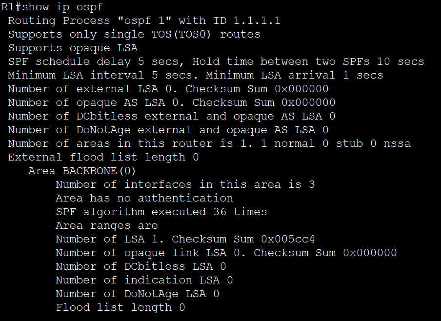
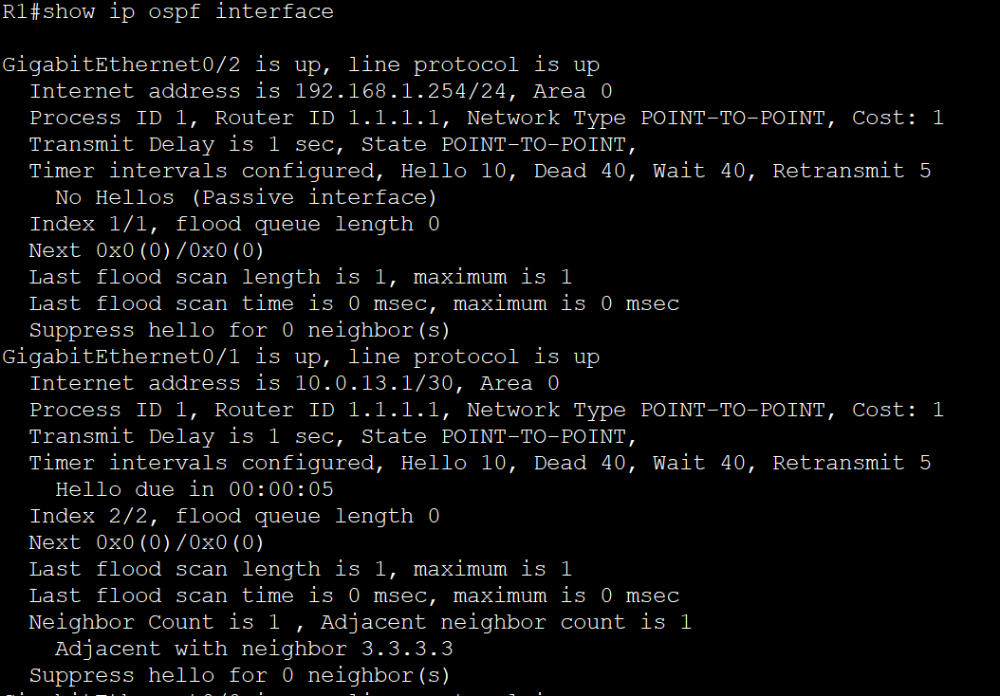
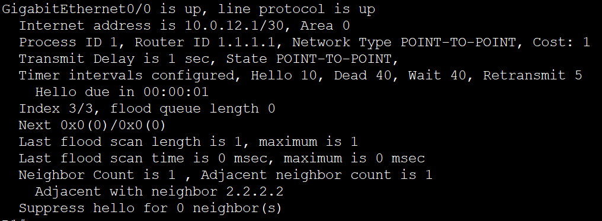
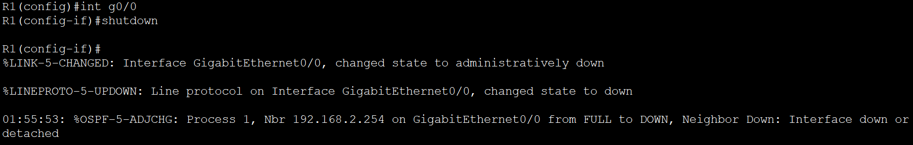
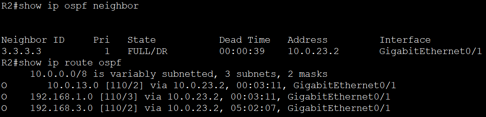
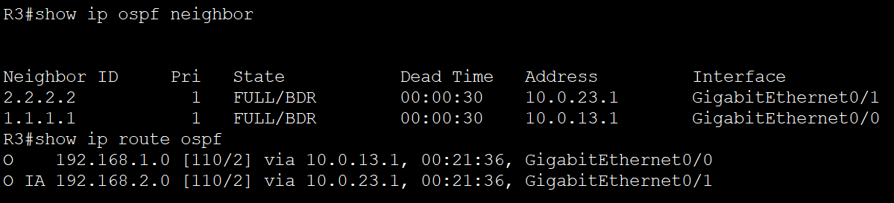

# Lab 1 — OSPF Single-Area Multi-Site Network

| | |
|---|---|
| **Type** | OSPF Single-Area (Area 0), Fully Meshed Multi-Site Topology |
| **Platform** | Cisco Packet Tracer |
| **IOS Version** | Cisco IOS (2911 Series Routers) |
| **Skills Demonstrated** | OSPF neighbour adjacency, loopback-based Router IDs, point-to-point network type optimisation, passive interface security, link failure simulation, autonomous reconvergence |
| **Devices** | 3× Cisco 2911 Routers, 3× Switches, 3× PCs |
| **Time to Review** | ~3 min |

---

## Topology

Three routers simulate geographically distributed branch offices, each serving a dedicated LAN segment. All routers are fully meshed via point-to-point /30 links — the industry-standard prefix length for router-to-router links, conserving address space by providing exactly two usable host addresses per segment. All interfaces participate in a single OSPF Area 0 (Backbone Area), ensuring a flat, scalable routing domain.

### IP Addressing

| Link / Segment | Network | R1 | R2 | R3 |
|---|---|---|---|---|
| R1–R2 | 10.0.12.0/30 | .1 | .2 | — |
| R1–R3 | 10.0.13.0/30 | .1 | — | .2 |
| R2–R3 | 10.0.23.0/30 | — | .1 | .2 |
| R1 LAN | 192.168.1.0/24 | .254 | — | — |
| R2 LAN | 192.168.2.0/24 | — | .254 | — |
| R3 LAN | 192.168.3.0/24 | — | — | .254 |
| R1 Loopback | 1.1.1.1/32 | — | — | — |
| R2 Loopback | 2.2.2.2/32 | — | — | — |
| R3 Loopback | 3.3.3.3/32 | — | — | — |

> LAN-facing interfaces were assigned the last usable host address (.254) as a deliberate convention, clearly distinguishing gateway addresses from end-host addresses at a glance.

---

## Objectives

- Establish and verify full OSPF adjacency across all three routers using loopback-stabilised Router IDs
- Confirm complete route propagation — every router's table must reflect all remote LAN subnets via OSPF
- Apply enterprise-grade optimisations: point-to-point network type on WAN links, passive interfaces on LAN-facing ports
- Simulate a link failure and validate autonomous OSPF reconvergence via the alternate path without manual intervention

---

## Configuration Decisions & Rationale

### Loopback Interfaces as Router IDs
OSPF selects its Router ID from the highest active IP address on the router unless manually overridden. Relying on a physical interface for this is operationally risky — if that interface goes down, the Router ID changes, forcing unnecessary OSPF reconvergence across the entire area. Loopback interfaces are logical, always-up constructs that provide a stable, persistent identity for each router regardless of physical link state. Router IDs were explicitly configured via the `router-id` command and verified with `show ip ospf`.

### Point-to-Point Network Type on WAN Links
By default, OSPF treats Ethernet interfaces as broadcast networks and runs a Designated Router / Backup Designated Router (DR/BDR) election — a mechanism designed for multi-access segments with multiple routers. On a point-to-point link between exactly two routers, this election is meaningless overhead. Configuring `ip ospf network point-to-point` on all WAN-facing interfaces eliminates the DR/BDR process entirely, reduces OSPF hello overhead, and accelerates adjacency formation. Confirmed by `FULL/-` neighbour state (Priority 0, no DR/BDR elected) across all three routers.

### Passive Interfaces on LAN-Facing Ports
OSPF hello packets serve one purpose on LAN interfaces: discovering neighbours. Since no OSPF-capable routers exist on the LAN segments — only end hosts — transmitting hellos there is both wasteful and a minor security exposure (it reveals routing process information to the LAN). Configuring `passive-interface` on all LAN-facing ports suppresses hello transmission while continuing to advertise those networks into OSPF. Confirmed by `No Hellos (Passive interface)` in `show ip ospf interface` output.

---

## Verification

### Router ID Confirmation

`show ip ospf` confirms Router ID 1.1.1.1 sourced from the loopback interface — not the physical interface.

### Interface-Level Verification — Point-to-Point & Passive Interface

`show ip ospf interface` on R1 confirms all three design decisions simultaneously:
- **G0/2 (LAN):** `Network Type POINT-TO-POINT`, `No Hellos (Passive interface)` — hello suppression active
- **G0/1 and G0/0 (WAN):** `Network Type POINT-TO-POINT` — DR/BDR election eliminated

---

## Results

### OSPF Neighbour Adjacency — All Routers (Before Failure)

All three routers achieved `FULL/-` adjacency state — confirming successful point-to-point operation with no DR/BDR overhead. Priority 0 on all neighbours is the expected behaviour when `ip ospf network point-to-point` is applied, as DR/BDR elections are suppressed entirely.

### OSPF Routing Tables — All Routers (Before Failure)

Each router's routing table reflects all remote LAN subnets learned via OSPF (`O` entries), confirming complete route propagation across the backbone area. Equal-cost paths are visible where applicable, demonstrating OSPF's native load-balancing behaviour across the fully meshed topology.

---

### Link Failure Simulation — R1 G0/0 Shutdown

The R1-facing interface (G0/0) was administratively shut down to simulate an unplanned link failure on the R1–R2 segment. The IOS console immediately generated an OSPF adjacency change notification, confirming the protocol detected the failure in real time without requiring manual intervention.

### OSPF Reconvergence — All Routers (After Failure)

Following the link failure, OSPF autonomously reconverged. R1 and R2 rerouted traffic through R3, with updated routing tables reflecting the new best paths. All remote LAN subnets remained reachable — the network self-healed without any administrative action.

### End-to-End Connectivity — Verified After Failure

A ping from PC1 (192.168.1.1) to PC2 (192.168.2.1) was issued immediately following the link failure. 3 of 4 packets succeeded (75% success rate). The single dropped packet is expected behaviour — it reflects the ARP resolution and OSPF reconvergence window that occurs in the brief interval between link detection and routing table update. This is not packet loss in the traditional sense; it is the measurable cost of convergence time, and it confirms the network recovered autonomously within sub-second timeframes for subsequent traffic.

---

## What I Learned

The most significant insight from this lab was that OSPF's value is not in the initial configuration — it is in what happens when something breaks. Watching the routing tables reconverge autonomously after shutting down the R1–R2 link made the protocol's purpose tangible in a way that theory alone cannot replicate.

Three configuration decisions in this lab reflect enterprise practice rather than basic exam knowledge:

**Loopbacks as Router IDs** exposed why stability matters at the identity level. A router's OSPF identity should never be tied to a physical interface that can go down — the reconvergence that would trigger is unnecessary and disruptive.

**Point-to-point network type** removed a default behaviour that made no architectural sense for this topology. DR/BDR elections exist for multi-access networks; applying them to a two-router point-to-point link is overhead without benefit. The `FULL/-` neighbour state across all routers is the proof.

**Passive interfaces** reinforced that network hardening is not a separate discipline from network engineering — it is embedded in it. Suppressing OSPF hellos on LAN-facing ports is a one-line decision that eliminates unnecessary protocol exposure to end hosts without affecting routing functionality.

The 25% ping loss post-failure is worth noting: it is not a misconfiguration. It is ARP — the first packet after reconvergence triggers an ARP request to resolve the next-hop MAC address on the new path, which takes one round-trip to complete. Every subsequent packet succeeds. Understanding *why* the first packet drops is more operationally useful than blindly re-running the ping until it shows 0% loss.

---

## File Index

| File | Description |
|---|---|
| `OSPF_Demo_Lab.pkt` | Packet Tracer source file — open to inspect full device configurations |
| `Topology.png` | Full topology diagram with IP addressing |
| `R1_OSPF_Verification.png` | `show ip ospf` confirming Router ID 1.1.1.1 |
| `R1_OSPF_Interfaces_Verification_1.png` | `show ip ospf interface` — G0/2 passive, G0/1 point-to-point |
| `R1_OSPF_Interfaces_Verification_2.png` | `show ip ospf interface` — G0/0 point-to-point |
| `R1_OSPFNeighbors_before.png` | R1 neighbours in FULL/- state before failure |
| `R2_OSPFNeighbors_before.png` | R2 neighbours in FULL/- state before failure |
| `R3_OSPFNeighbors_before.png` | R3 neighbours in FULL/- state before failure |
| `R1_OSPFRoutes_before.png` | R1 routing table — all remote LANs learned via OSPF |
| `R2_OSPFRoutes_before.png` | R2 routing table — all remote LANs learned via OSPF |
| `R3_OSPFRoutes_before.png` | R3 routing table — all remote LANs learned via OSPF |
| `R1-R2_Link_shutdown.png` | Interface shutdown simulating link failure with OSPF adjacency change log |
| `R1_OSPFNeighbors_Routes_After_LinkFailure.png` | R1 reconverged state — rerouted via R3 |
| `R2_OSPFNeighbors_Routes_After_LinkFailure.png` | R2 reconverged state — rerouted via R3 |
| `R3_OSPFNeighbors_Routes_After_LinkFailure.png` | R3 reconverged state — updated paths |
| `PingPC1-PC2.png` | End-to-end ping confirming connectivity survived the failure |
