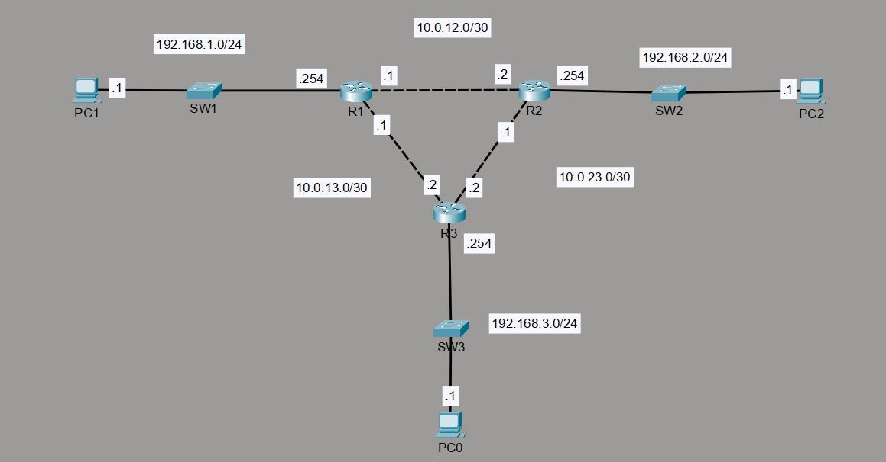
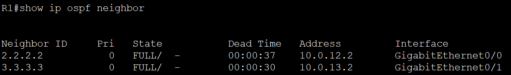
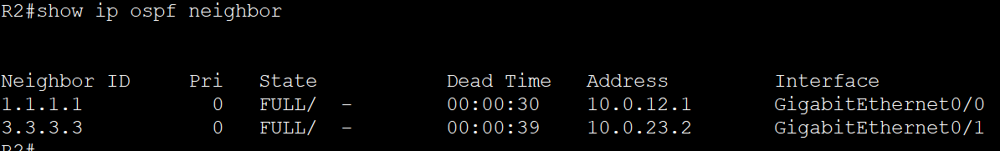
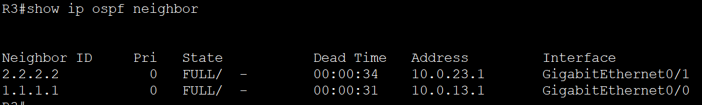
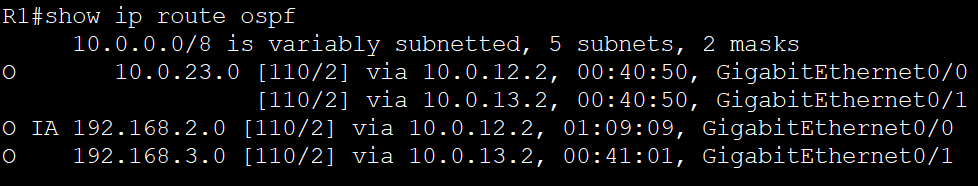
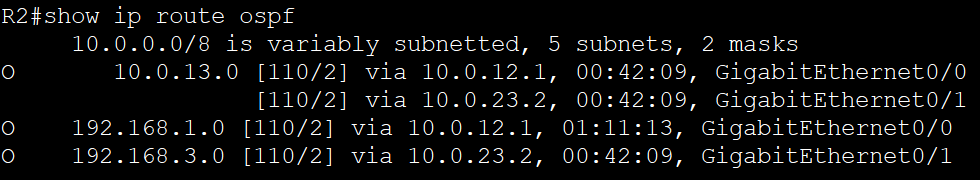
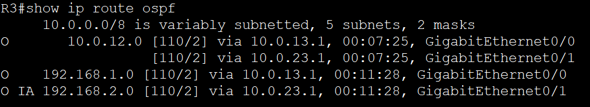
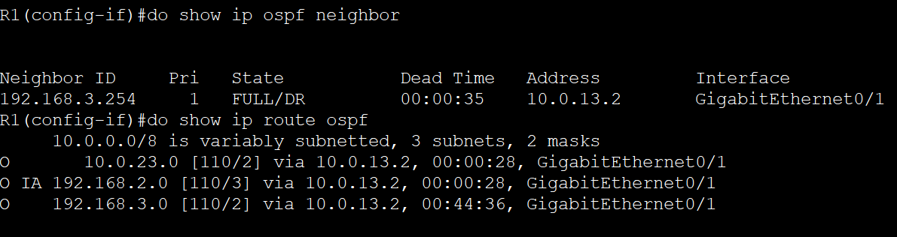
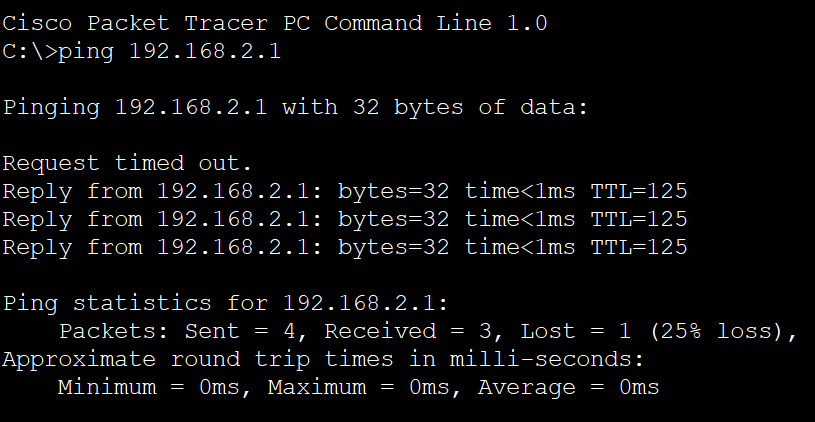

# Lab 1 — OSPF Single-Area Multi-Site Network

| | |
|---|---|
| **Type** | OSPF Single-Area (Area 0), Multi-Site Topology |
| **Tools** | Cisco Packet Tracer, IOS-XE |
| **Skills Demonstrated** | OSPF neighbour formation, route propagation, link failure & reconvergence |
| **Devices** | 3× Cisco 8200 Series Routers, 3× PCs |
| **Time to Review** | ~2 min |

---

## Topology

Three routers simulate geographically separate branch offices, each with a local LAN segment. All routers are fully meshed via point-to-point /30 links and participate in OSPF Area 0.

### IP Addressing

| Link / Segment | Network | R1 | R2 | R3 |
|---|---|---|---|---|
| R1–R2 | 10.0.12.0/30 | .1 | .2 | — |
| R1–R3 | 10.0.13.0/30 | .1 | — | .3 |
| R2–R3 | 10.0.23.0/30 | — | .2 | .3 |
| R1 LAN | 192.168.1.0/24 | .1 | — | — |
| R2 LAN | 192.168.2.0/24 | — | .1 | — |
| R3 LAN | 192.168.3.0/24 | — | — | .1 |
| R1 Loopback | 1.1.1.1/32 | ✓ | — | — |
| R2 Loopback | 2.2.2.2/32 | — | ✓ | — |
| R3 Loopback | 3.3.3.3/32 | — | — | ✓ |

---

## Objectives

- Configure OSPF Area 0 across all three routers and verify full neighbour adjacency
- Confirm all LAN networks are propagated and visible in each router's routing table
- Simulate a link failure and verify the network reconverges via the alternate path

---

## Results

### OSPF Neighbour Adjacency — All Routers (Before Failure)

All three routers established full OSPF adjacency. Loopbacks were used as Router IDs for stability.

### OSPF Routing Tables — All Routers (Before Failure)

Each router's routing table shows all remote LAN subnets learned via OSPF (O entries).

---

### Link Failure — R1–R2 Shutdown

The R1-facing interface on R2 was administratively shut down to simulate a link failure.

### OSPF Reconvergence — All Routers (After Failure)

OSPF detected the failure and reconverged. Traffic between R1 and R2 was automatically rerouted via R3. All three routing tables updated to reflect the new best path.

### End-to-End Connectivity Verified After Failure

A ping from PC1 (192.168.1.x) to PC2 (192.168.2.x) confirmed that end-to-end connectivity was maintained through the alternate path with no manual intervention.

---

## What I Learned

OSPF's value isn't in the initial configuration — it's in what happens when something breaks. Shutting down the R1–R2 link and watching the routing tables reconverge via R3 made the protocol's purpose tangible in a way that reading about it doesn't. Using loopbacks as Router IDs also reinforced why stability matters: a physical interface going down shouldn't change who a router thinks it is.

Using IOS-XE on the Cisco 8200 series introduced three-level interface naming (`GigabitEthernet0/0/0`) compared to classic IOS — a small but real difference worth knowing before working on modern enterprise hardware.

---

## Files

| File | Description |
|---|---|
| `OSPF_Demo_Lab.pkt` | Packet Tracer source file — open to inspect full configuration |
| `Topology.png` | Full topology diagram with IP addressing |
| `R1/R2/R3_OSPFNeighbors_before.png` | Neighbour adjacency on all routers before failure |
| `R1/R2/R3_OSPFRoutes_before.png` | Routing tables on all routers before failure |
| `R1-R2_Link_Shutdown.png` | Interface shutdown command simulating link failure |
| `R1_OSPFNeighbors_Routes_After_LinkFailure.png` | R1 state after reconvergence |
| `R2_Neighbors_Routes_After.png` | R2 state after reconvergence |
| `R3_OSPFNeighbors_Routes_After.png` | R3 state after reconvergence |
| `PingPC1-PC2.png` | End-to-end ping confirming connectivity survived the failure |